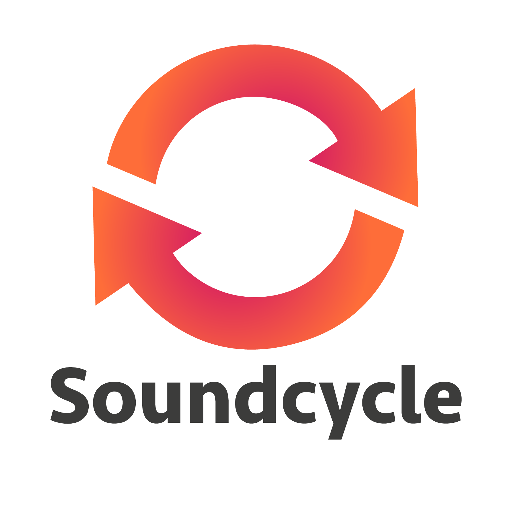

# The first browser based software loopstation

## What is Soundcycle? :wave:
Soundcycle is an open source software loopstation which runs entirely in your browser. It aims to be easy to use and accessible for everyone.

__Note:__ It's now a long time ago since I started developing Soundcycle. I wanted to open source it earlier, but until now I didn't have time to. I hope that people like YOU can bring Soundcycle to another level, since I don't have time to do all of it alone!

Read the article on Medium I've written about Soundcycle:

## Using it :musical_note:
Navigate to [https://scriptify.github.io/soundcycle/](https://scriptify.github.io/soundcycle/) to see it in the wild.

It may look like this when you create a song:
GIF

Here are some example songs I recorded with Soundcycle:
....

For recording, I've used the Steinberg UR22 audio interface.

__Note:__ If you have created something with Soundcycle you want to share with others, contact me (or issue a pull request) and I'll add it here.

__Another note:__ Until now I've just used and developed Soundcycle with newer versions of Chrome. Browser support is something which has to be clarified yet (if you look a the [TODO-list](/TODOs.md)). So I can't guarantee that it will work in your favourite browser. The same applies to mobile devices.

__Yet another note:__ TBH, this sections needs some drasticals improvements. But as my time is limited, I'll keep ist simple for now. But a detailed explaination of all features is planned here.

## Why? :runner:
The motivation for this project is a really personal one. I am a passionate beatboxer and I was always fascinated about loopstations. But since loopstations aren't that cheap to afford and everyone of us has a pretty suitable piece of hardware at home (I mean your computer), I thought: "Hey, why don't I try to create one myself?"
This is how everything started. And as I am really interested into web technologies, I decided to implement a web application. Technically seen, this isn't the best choice I've ever made, but I think that it is a really interesting experiment. And I think this project could become much more than just an experiment.

The project started out as school project, but now I would like to continue it with YOU, as I am not able to do that alone.

## How to contribute :octocat:
If you want to contribute to this project (no matter WHAT you want to do, it can also be something NON techical), have a look at the [CONTRIBUTION GUIDELINES](/CONTRIBUTING.md)

Spoiler: __Everyone__ can do something to enhance Soundcycle.

A good starting point to contribute to this project is the [TODO-list](/TODOs.md). But your contributions aren't limited to that list, and if you think something should be added to this list, just add it to this file. Every contribution can be of value. :octocat:

## Developing
### Installing all dependencies
```bash
npm i
```

### Starting the development server
```bash
npm run start:dev
```

### Building the project
```bash
npm run start:prod
```

## Code of conduct :globe_with_meridians:
Have a look at [CODE_OF_CONDUCT.md](/CODE_OF_CONDUCT.md)

## License :goat:
Have a look at [LICENSE.md](/LICENSE.md)

## Get in touch :point_left:
If you have any questions or just want to have a chat, contact me via Twitter: @scriptifyjs

I'm always glad to here some __feedback__!
